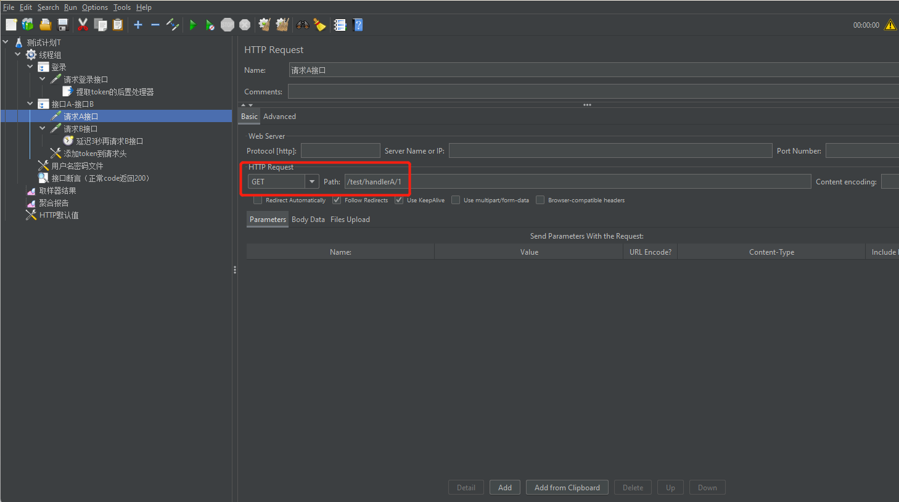

# 前言

Master机开了好多东西，比如K8S、MySQL、Nacos，本身资源就很紧张了，所以将Jmeter安装在物理机Window11上，被压测程序放在Master机，做到 `压测机资源` 和 `被压测机资源`的隔离。

# 概念

Jmeter的1个test plan相当于**多个**测试用例，1个测试用例可以包含多次接口行为，比如估值用例：

1. 用户U访问A接口，获取可估值信息。
2. 用户U填写信息，调用B接口，进行估值信息保存。
3. 用户U调用C接口，进行估值。

1个 test plan 通过Jmeter提供的多个element，结合我们开发、测试人员的配置，形成一个完整的用例。

1个 test plan 内通过1个线程来模仿用户的行为，有可能1个线程会执行多次接口行为（参考上面的估值用例）？

但是1个线程太少了，无法模拟多用户的测试用例，因此1个 test plan 也可以维护一个线程池，用里面的线程来模拟多用户的**同一种（或者同一用例）**操作，比如模拟50个用户一起操作上面的估值用例。

## 线程组ThreadGroup

1. 线程数：组内的线程总数。

2. Ramp-Up时间：组内线程执行的间隔时间，有点类似流控算法中的匀速队列限制。打个比方，定义线程数5，Ramp-Up时间1后，Jmeter会控制线程之间的执行间隔200ms：

   线程1开始执行------200ms------线程2开始执行------200ms------线程3开始执行------200ms------线程4开始执行------200ms------线程5开始执行。

3. 循环次数：定义`组内所有线程执行完`为1个Event，循环次数控制Event的数量。


如图所示，测试计划定义了一个线程组，组内定义了750个线程，ramp-up时间定为1秒，最终会13毫秒左右使用1个线程请求，即我们所说的750QPS

## 事务控制器Transaction Controller

它和TPS中的T是同一个概念，一般来说一个页面会操作多个接口，比如用户请求A接口获取关键信息，再请求B接口提交信息，从而组成页面上一个完成的业务逻辑，接口A和接口B组成一个事务控制器：


如图所示，线程组分别配置了两个事务控制器，分别处理`登录功能` 和`先请求接口A后请求接口B功能`。

## HTTP默认配置HTTP Request Defaults

用来配置HTTP的默认信息：


如图所示，配置了本次被测系统的url、端口、协议。

## CSV数据集

很多时候，一些关键的接口信息是用户级别的，比如登录接口，它的用户名密码总不能一个一个添加到测试计划的环境变量里吧？因此Jmeter提供了读取外部CSV文件，解析列数据到环境变量的功能：


如图所示，这里面定义了CSV文件的目录地址、编码、忽略首行，当文件读完后线程池不会继续读取数据，并且会终止测试计划。同时按顺序将CSV的列赋值到username和password变量里，后续的Sampler可以通过${username}、${password}使用变量。

## 取样器Sampler

1种具体的HTTP请求，是通过HTTP Sampler来定义的，当然还有其他取样器，用来定义其他协议的请求，这里只注重讲HTTP协议。通过HTTP Sampler可以定义1种HTTP请求的url、method、header、端口等信息，可以理解为定义POSTMAN用例：



如图所示，在`登录`和`接口A-接口B`两个事务控制器里分别配置了`登录接口`和`A接口`、`B接口`这三个Sampler。**并且在Sampler被HTTP默认配置影响的前提下，默认配置优先级最高，当Sampler和默认值冲突的情况下，Sampler优先级更高。**

## JSON提取器JSON Extractor

后置处理器 从 取样器的响应结果中 提取响应数据，存入变量，后续在请求体中使用变量进行请求：


如图所示，在登录接口内定义了JSON提取器，它将响应体

```json
{
    "code":"",
    "message":"",
    "data":""
}
```

里的code、message、data的值分别赋值给code、message、token变量。在后续的接口请求中可以通过${}使用这些变量，比如HTTP Sampler的参数定义、HTTP Header Manager的请求头定义：


如图所示，这里给接口A-接口B事务定义了一个HTTP Header Manager，在请求接口A和接口B时，请求头都会带上token参数。

## 结果树ViewResultTree


监听某个HTTP请求的结果、响应时间，里面包含了我们对压测结果感兴趣的数据：

Load time：`开始请求` 到 `接收完所有响应` 的耗时。

Connect Time：Jmeter和被测系统建立TCP连接的时间，包含3次握手。

Latency：`开始请求` 到 `接收完第一个响应` 的耗时。

size in bytes：响应报文大小。

send bytes：请求报文大小。

ssheaders size in bytes：响应头大小。

Body size in bytes：响应体的大小。

## 聚合报告Aggregate Report

ViewResultTree是细分到每个事务、接口的统计，有时候我们更关心一个测试计划跑下来的整体结果，这时候可以使用聚合报告：


如图所示，在上面的压测用例中，展示了5组数据，其中`登录`和`接口A-接口B`属于事务统计，而`请求登录接口`、`请求A接口`、`请求B接口`属于Sampler层面的统计，它们每个指标的含义如下：

|      指标       |               含义               |
| :-------------: | :------------------------------: |
|     Sampler     |              用例数              |
|     Average     |           平均响应时间           |
|     Median      |           中位响应时间           |
|    90% Line     | 有90%的请求，它的响应时间≤这个值 |
|    95% Line     | 有95%的请求，它的响应时间≤这个值 |
|    99% Line     | 有99%的请求，它的响应时间≤这个值 |
|       Min       |           最小响应时间           |
|       Max       |           最大响应时间           |
|      Error      | 接口出错率（包含自定义断言出错） |
|   Throughput    | 吞吐量（和JVM的吞吐量定义相同）  |
| Received KB/sec |        每秒发出的报文大小        |
|   Sent KB/sec   |        每秒接收的报文大小        |

